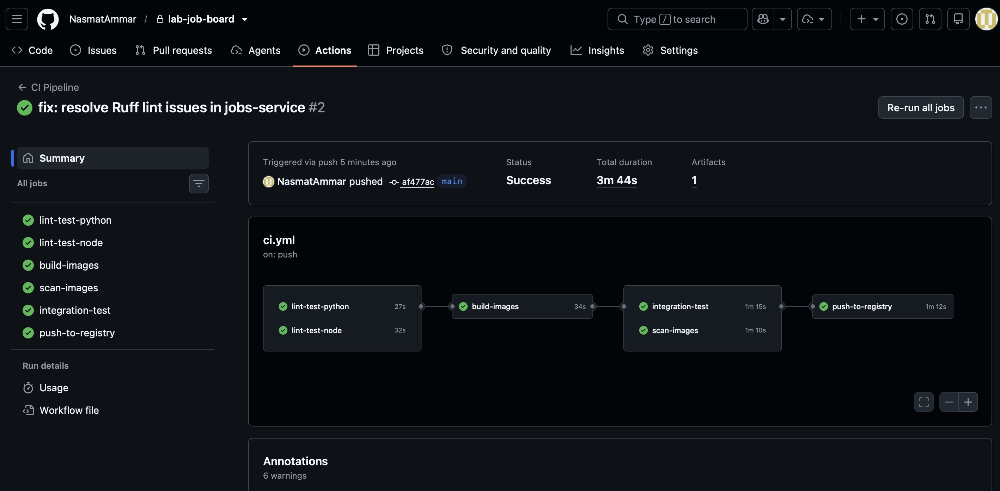
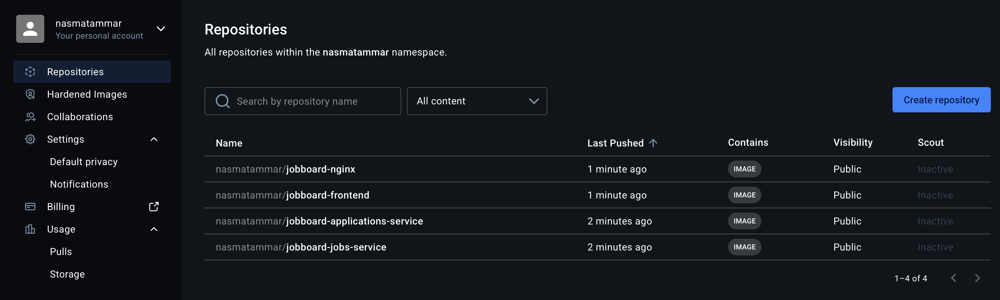
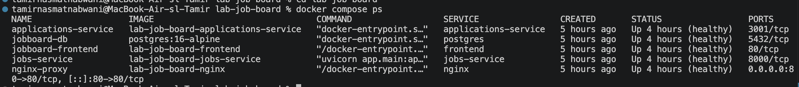
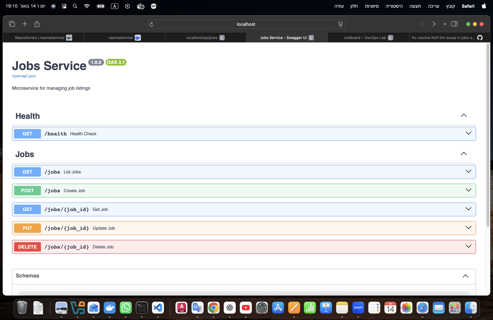

# Task 1 — Dockerfile Analysis & Hardening

Date: 2026-08-14

## 1.1 Vulnerability Scan (Trivy)

### Commands used

```bash
docker compose build

docker tag lab-job-board-jobs-service:latest jobboard-jobs-service:latest
docker tag lab-job-board-applications-service:latest jobboard-applications-service:latest
docker tag lab-job-board-frontend:latest jobboard-frontend:latest

trivy image jobboard-jobs-service:latest
trivy image jobboard-applications-service:latest
trivy image jobboard-frontend:latest
```

### Results summary

- CRITICAL vulnerabilities in `jobboard-jobs-service:latest`: **4**
- CRITICAL vulnerabilities in `jobboard-applications-service:latest`: **1**
- CRITICAL vulnerabilities in `jobboard-frontend:latest`: **0**
- **Total CRITICAL CVEs across all 3 images: 5**

Total vulnerabilities (all severities):
- `jobboard-jobs-service:latest`: **191**
- `jobboard-applications-service:latest`: **28**
- `jobboard-frontend:latest`: **0**

Image with the most vulnerabilities: **jobboard-jobs-service:latest**

### One CRITICAL CVE and explain

Selected CVE: **CVE-2026-59873**

1. What it is:
A Denial of Service vulnerability in tar extraction logic (`node-tar`) where a crafted gzip bomb can consume excessive CPU/disk during parsing/extraction.

2. Affected package:
- Package: `tar`
- Installed version: `6.2.1`
- Fixed version: `7.5.19`

3. Fix / mitigation:
- Upgrade to a patched version (`tar >= 7.5.19`) via dependency updates.
- Rebuild image with updated lockfile / dependency tree.
- Keep base images updated and rescan regularly in CI (Trivy gate).

## 1.2 Dockerfile Hardening

I applied hardening to **two required Dockerfiles**:
- `jobs-service/Dockerfile`
- `applications-service/Dockerfile`

### Changes made

1. Pin `FROM` images to exact digests
- `python:3.12-slim@sha256:dd29372629eeba2dd003fd9e9d35a5b8236c44727875a0364254b5127af88e65`
- `node:20-alpine@sha256:fb4cd12c85ee03686f6af5362a0b0d56d50c58a04632e6c0fb8363f609372293`

2. Keep non-root execution (verified)
- `docker run --rm jobboard-jobs-service:latest whoami` -> `appuser`
- `docker run --rm jobboard-applications-service:latest whoami` -> `appuser`

3. Reduce final-image layers
- Removed standalone `RUN chown -R ...` layers.
- Replaced with `COPY --chown=...` in final stages.
- Existing `RUN` commands already use `&&` chaining where applicable.

4. `.dockerignore` verification
- `.dockerignore` exists in all service directories (`jobs-service`, `applications-service`, `frontend`).
- They exclude common noisy/sensitive paths such as `node_modules`, `.env`, `.git`, logs, and markdown/docs.

5. `HEALTHCHECK` verification
- Both target Dockerfiles already include a healthcheck and point to the correct local health endpoint:
  - jobs-service: `http://localhost:8000/health`
  - applications-service: `http://localhost:3001/health`

## Before/After Image Sizes

Baseline (before hardening):
- `jobboard-jobs-service:latest` (same image as `lab-job-board-jobs-service:latest`): **300MB**
- `jobboard-applications-service:latest` (same image as `lab-job-board-applications-service:latest`): **229MB**
- `jobboard-frontend:latest`: **101MB**

After hardening:
- `jobboard-jobs-service:latest`: **300MB**
- `jobboard-applications-service:latest`: **219MB**
- `jobboard-frontend:latest`: **101MB**

Size reduction achieved:
- `applications-service`: **-10MB**
- `jobs-service`: **0MB** (security/reproducibility improved via digest pinning and ownership-at-copy without measurable size change)
- Combined change for the two target images: **-10MB**

---------------------------------------------------------------------------------------

# Task 2 — Docker Compose Orchestration

## 2.1 Logging configuration

Added this logging block to every service in `docker-compose.yml`:

```yaml
logging:
  driver: json-file
  options:
    max-size: "10m"
    max-file: "3"
```

## 2.2 Environment variable isolation

### Changes and verification

1. Created `.env` from template:

```bash
cp .env.example .env
```

2. Set strong password (16+ chars, mixed case + symbols):


3. Removed default password fallback from compose so env is required:
- From: `${POSTGRES_PASSWORD:-jobboard123}`
- To: `${POSTGRES_PASSWORD:?POSTGRES_PASSWORD}`

4. Confirmed removing `.env` breaks config/stack startup:


5. Restored `.env` and confirmed config works:


6. Verified `.env` is not staged for commit:
- `git status --short` did not show `.env`.
- `.gitignore` already contains `.env`.

### Why committing `.env` is a security risk

If `.env` is committed, secrets are exposed in Git history and can be copied by anyone with repository access. Even if removed later, secrets can remain in previous commits.

## 2.3 Service restart policy and dependency ordering

### Startup order verification

Using the requested command:

```bash
docker compose up --build 2>&1 | grep -E "healthy|started|Starting"
```

And (for case-insensitive matching of `Healthy`) this variant:

```bash
docker compose up --build 2>&1 | grep -Ei "healthy|started|starting"
```

Observed order:
1. `jobboard-db` starts and becomes **Healthy**
2. `jobs-service` and `applications-service` start and become **Healthy**
3. `jobboard-frontend` is created/started after both app services are healthy
4. `nginx-proxy` is created/started after frontend and API services

This matches the expected dependency sequence.

### Dependency graph (ASCII)

```text
postgres (service_healthy)
   |\
   | \__ applications-service
   |
   \____ jobs-service

jobs-service (service_healthy) ----\
                                    \__ frontend
applications-service (service_healthy) /

frontend ----------------------------\
jobs-service -------------------------\__ nginx
applications-service ----------------/
```

### `service_healthy` vs `service_started`

- `condition: service_started`
  waits only until the container process starts.
  It does not guarantee app readiness.

- `condition: service_healthy`
  waits until the dependency passes its healthcheck.
  This is stricter and prevents many startup race conditions.

### What happens if postgres crashes after others are running?

Verification command used:

```bash
docker compose stop postgres
```

Observed behavior:
- `postgres` stopped.
- Other containers (`jobs-service`, `applications-service`, `frontend`, `nginx`) remained running.
- Request to app endpoint returned error while DB was down:
  - `GET http://localhost/api/jobs/` -> HTTP `500 Internal Server Error`

Conclusion:
- `depends_on` controls startup order only.
- It does not continuously enforce runtime dependency health or cascade-stop dependents when `postgres` fails.

---------------------------------------------------------------------------------------

# Task 3 — Data Persistence & Backup

## 3.1 Verify persistence across restarts

### Step 1: Create a new job

Command used:

```bash
curl -s -X POST http://localhost/api/jobs/ \
  -H "Content-Type: application/json" \
  -d '{"title":"Persistence Test Job","description":"Testing Docker volumes","company":"Lab Inc","location":"Docker"}' \
  | python3 -m json.tool
```

Created job result (key fields):
- `id`: `661400dd-a845-4014-8610-18323ee1acaf`
- `title`: `Persistence Test Job`
- `company`: `Lab Inc`

### Step 2: Restart containers without deleting volumes

Commands used:

```bash
docker compose stop
docker compose start
```

### Step 3: Verify job still exists

Command used:

```bash
curl -s http://localhost/api/jobs/ | python3 -m json.tool
```

Verification outcome:
- Persistence check found the created record after restart.
- `found_count = 1`
- Found id: `661400dd-a845-4014-8610-18323ee1acaf`

### `docker compose down` vs `docker compose down -v` vs `docker compose stop`

- `docker compose stop`
  stops containers only. Containers, networks, and volumes remain.
  Use when you want a quick pause/resume while keeping full state.

- `docker compose down`
  stops and removes containers and default network. Named volumes remain unless `-v` is used.
  Use when you want a clean restart of containers but keep persisted DB data.

- `docker compose down -v`
  does everything from `down` and also removes named volumes.
  Use when you intentionally want a full reset, including database data.

## 3.2 Volume inspection

Commands used:

```bash
docker volume inspect jobboard-postgres-data
docker volume ls
```

Observed volume details:
- Volume name: `jobboard-postgres-data`
- Driver: `local`
- Mountpoint: `/var/lib/docker/volumes/jobboard-postgres-data/_data`

### Where data is stored on host

- Docker reports the data path as `/var/lib/docker/volumes/jobboard-postgres-data/_data`.
- On macOS with Docker Desktop, this path exists inside Docker's Linux VM backend (not as a normal Finder path on the macOS filesystem).

### Named volume vs bind mount

- Named volume (`postgres-data:/var/lib/postgresql/data`):
  Docker manages lifecycle/location. Portable and simpler for databases.

- Bind mount (`./data:/var/lib/postgresql/data`):
  Directly maps a host directory. Easier manual access from host tools, but tighter coupling to host path/permissions.

### Production preference

- Prefer named volumes for stateful services like PostgreSQL in most production Docker setups (safer defaults, easier portability).
- Prefer bind mounts when you explicitly need host-level file access, external backup tooling tied to host paths, or specific host filesystem controls.

## 3.3 Database backup and restore

### Backup command executed

```bash
docker exec jobboard-db pg_dump \
  -U postgres \
  -d jobboard \
  --no-owner \
  --no-acl \
  -F plain > backup_$(date +%Y%m%d_%H%M%S).sql
```

Generated file:
- `backup_20260814_150548.sql`

### Backup verification commands executed

```bash
head -30 backup_20260814_150548.sql
grep -c "INSERT INTO" backup_20260814_150548.sql
```

Verification notes:
- `head` shows a valid PostgreSQL dump header and SQL DDL.
- `grep -c "INSERT INTO"` returned `0` because this plain dump uses `COPY` blocks instead of `INSERT` statements by default.
- Additional check: `grep -c "^COPY public\." backup_20260814_150548.sql` returned `2`.

### Exact restore procedure (fresh container)

Replace `<BACKUP_FILE>` with your backup filename (for example `backup_20260814_150548.sql`).

```bash
# 1) Start from a fresh postgres container/volume
docker compose down -v
docker compose up -d postgres

# Optional: wait until postgres is healthy
docker compose ps

# 2) Copy backup SQL into container
docker cp <BACKUP_FILE> jobboard-db:/tmp/restore.sql

# 3) Restore into target database
# Reset public schema first to avoid conflicts with pre-seeded/init objects
docker exec jobboard-db psql -U postgres -d jobboard -c "DROP SCHEMA IF EXISTS public CASCADE; CREATE SCHEMA public;"
docker exec jobboard-db psql -U postgres -d jobboard -f /tmp/restore.sql

# 4) Start remaining services
docker compose up -d
```

---------------------------------------------------------------------------------------

# Task 4 — CI/CD Pipeline with GitHub Actions




---------------------------------------------------------------------------------------

# Task 5 — Networking & Service Communication

## 5.1 Understand the Docker network

Command used:

```bash
docker network inspect jobboard-network
```

Containers on `jobboard-network` and their IP addresses:
- `jobboard-db` -> `172.19.0.2/16`
- `applications-service` -> `172.19.0.3/16`
- `jobs-service` -> `172.19.0.4/16`
- `jobboard-frontend` -> `172.19.0.5/16`
- `nginx-proxy` -> `172.19.0.6/16`

How `jobs-service` resolves `postgres`:
- Docker Compose attaches both containers to the same user-defined bridge network (`jobboard-network`).
- Docker's embedded DNS server automatically registers service/container names.
- Inside containers, `postgres` resolves to the DB container IP (in this run: `172.19.0.2`).

What happens if trying to reach `jobs-service:8000` from browser directly:
- `http://jobs-service:8000/...` from host browser fails DNS resolution (`Could not resolve host: jobs-service`) because that name exists only inside Docker network DNS.
- `http://localhost:8000/...` also fails (`connection refused`) because port `8000` is not published to host; only nginx publishes port `80`.

## 5.2 Inter-service communication test

Command used from README (executed non-interactive):

```bash
docker exec jobs-service python3 -c "
import psycopg2
import os
conn = psycopg2.connect(os.environ['DATABASE_URL'])
print('Connected to PostgreSQL:', conn.get_dsn_parameters())
conn.close()
"
```

Observed result:
- Connection succeeded.
- DSN output showed host `postgres`, db `jobboard`, port `5432`.

Additional in-network check from `jobs-service`:
- Request to `http://applications-service:3001/health` returned:
  `{"status":"healthy","service":"applications-service","version":"1.0.0"}`

## 5.3 Nginx routing analysis

Request traced:

`Browser -> POST http://localhost/api/applications/`

1. Matching nginx `location` block:
- `location /api/applications` in `nginx/nginx.conf`

2. Rewrite transformation:
- For trailing slash path, this rule applies:
  `rewrite ^/api/applications/(.*) /applications/$1 break;`
- So `/api/applications/` becomes `/applications/`.

3. Upstream target:
- `proxy_pass http://applications_service;`
- Upstream `applications_service` maps to `applications-service:3001`.
- That request is then handled by Express route `app.use('/applications', applicationsRouter)`.

4. Response path back to browser:
- `applications-service` processes request and returns JSON/HTTP status.
- Nginx forwards the upstream response back through `nginx-proxy:80` to the client browser.

Validation request used:

```bash
curl -X POST http://localhost/api/applications/ ...
```

Observed status/result:
- HTTP `201`
- JSON body returned with new application id (`3742c7fd-ffbe-415f-a78c-3fc83aee02bc`).

--------------

Screenshots:






# adding a new line just for new commit