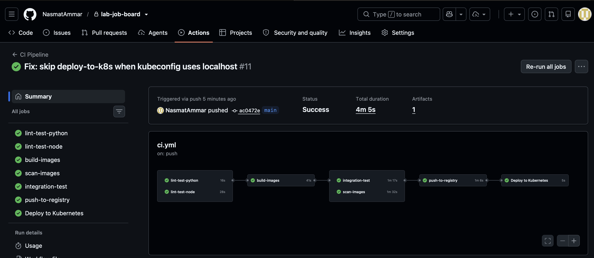
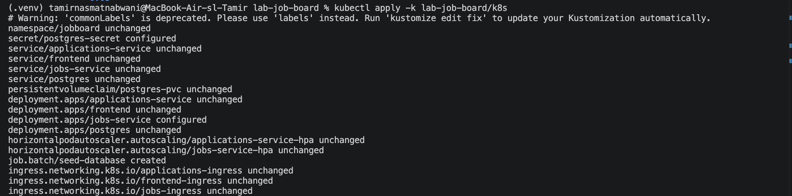
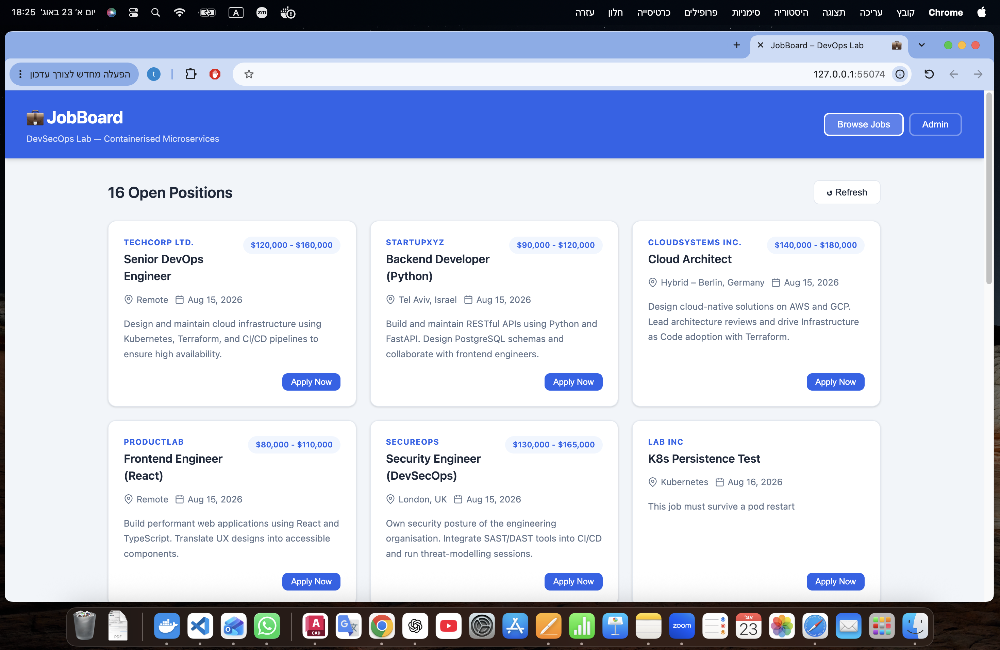

### Task 1 - Cluster Exploration (15 pts)

#### 1.1 - Inspect all objects (5 pts)

Command output snapshot:

```bash
$ kubectl get all -n jobboard
NAME                                        READY   STATUS    RESTARTS   AGE
pod/applications-service-745745ccc4-8jtw9   1/1     Running   0          33h
pod/applications-service-745745ccc4-9vhnk   1/1     Running   0          33h
pod/frontend-65754f76d6-zkzrz               1/1     Running   0          34h
pod/frontend-65754f76d6-zs7hx               1/1     Running   0          34h
pod/jobs-service-78db4c9c-2mjb6             1/1     Running   0          23h
pod/jobs-service-78db4c9c-7w26d             1/1     Running   0          23h
pod/postgres-77dbf976c6-vj4jj               1/1     Running   0          33h

NAME                           TYPE        CLUSTER-IP       EXTERNAL-IP   PORT(S)    AGE
service/applications-service   ClusterIP   10.108.41.199    <none>        3001/TCP   34h
service/frontend               ClusterIP   10.97.136.179    <none>        80/TCP     34h
service/jobs-service           ClusterIP   10.111.154.255   <none>        8000/TCP   34h
service/postgres               ClusterIP   10.98.24.218     <none>        5432/TCP   34h

NAME                                   READY   UP-TO-DATE   AVAILABLE   AGE
deployment.apps/applications-service   2/2     2            2           34h
deployment.apps/frontend               2/2     2            2           34h
deployment.apps/jobs-service           2/2     2            2           34h
deployment.apps/postgres               1/1     1            1           34h

NAME                                                           REFERENCE                         TARGETS                        MINPODS   MAXPODS   REPLICAS   AGE
horizontalpodautoscaler.autoscaling/applications-service-hpa   Deployment/applications-service   cpu: 2%/60%, memory: 20%/75%   2         6         2          34h
horizontalpodautoscaler.autoscaling/jobs-service-hpa           Deployment/jobs-service           cpu: 6%/60%, memory: 45%/75%   2         6         2          34h

$ kubectl get pvc -n jobboard
NAME           STATUS   VOLUME                                     CAPACITY   ACCESS MODES   STORAGECLASS   VOLUMEATTRIBUTESCLASS   AGE
postgres-pvc   Bound    pvc-87ca4403-8e3f-4ae4-b759-b27d2e250ad9   1Gi        RWO            standard       <unset>                 34h

$ kubectl get ingress -n jobboard
NAME                   CLASS   HOSTS   ADDRESS        PORTS   AGE
applications-ingress   nginx   *       192.168.49.2   80      34h
frontend-ingress       nginx   *       192.168.49.2   80      34h
jobs-ingress           nginx   *       192.168.49.2   80      34h

$ kubectl get hpa -n jobboard
NAME                       REFERENCE                         TARGETS                        MINPODS   MAXPODS   REPLICAS   AGE
applications-service-hpa   Deployment/applications-service   cpu: 2%/60%, memory: 20%/75%   2         6         2          34h
jobs-service-hpa           Deployment/jobs-service           cpu: 6%/60%, memory: 45%/75%   2         6         2          34h

$ kubectl get secret -n jobboard
NAME              TYPE     DATA   AGE
postgres-secret   Opaque   3      34h
```

Answers:

1. READY ratio for each Deployment:
	- applications-service: 2/2
	- frontend: 2/2
	- jobs-service: 2/2
	- postgres: 1/1

2. CLUSTER-IP of each Service:
	- applications-service: 10.108.41.199
	- frontend: 10.97.136.179
	- jobs-service: 10.111.154.255
	- postgres: 10.98.24.218


3. Storage class assigned to postgres-pvc:
	- standard, in minikube, standard usually maps to the default local storage provisioner.

#### 1.2 - Describe a Pod (5 pts)

Command used:

```bash
POD=$(kubectl get pods -n jobboard -l app=jobs-service -o jsonpath='{.items[0].metadata.name}')
kubectl describe pod $POD -n jobboard
```

Relevant output excerpt:

```text
Init Containers:
  wait-for-postgres:
	 Command:
		until nc -z postgres 5432; do
		  echo "Waiting for postgres..."; sleep 2
		done
		echo "PostgreSQL is ready."
	 State: Terminated (Completed)

Liveness:   http-get http://:8000/health delay=30s timeout=5s period=15s
Readiness:  http-get http://:8000/health delay=10s timeout=5s period=10s
```

Answers:

1. Which initContainer runs first and why?
	- wait-for-postgres runs first.
	- It blocks main container startup until postgres:5432 is reachable.
	- This prevents immediate startup failures from race conditions where app starts before DB is ready.

2. What do readinessProbe and livenessProbe check?
	- Both check GET /health on port 8000.
	- readinessProbe asks: should this pod receive traffic now?
	- livenessProbe asks: should this container be restarted because it is unhealthy/stuck?

3. Difference and failure behavior:
	- If readiness fails:
	  - Pod stays running, but is removed from Service endpoints.
	  - Traffic is not routed to it until readiness recovers.
	- If liveness fails repeatedly:
	  - Kubelet restarts the container in that pod.
	  - This is for self-healing from deadlocks or broken runtime state.

#### 1.3 - Exec into a pod (5 pts)


1. Full DNS name of postgres service:
	- postgres.jobboard.svc.cluster.local

2. Why short name postgres works:
	- The pod DNS search list includes jobboard.svc.cluster.local.
	- When app resolves postgres, resolver tries:
	  - postgres.jobboard.svc.cluster.local
	  - then other search suffixes
	- Since service and pod are in the same namespace, short service name is enough.

### Task 2 - Kubernetes Networking & Ingress (20 pts)

#### 2.1 - Trace an Ingress request (8 pts)

Requested flow:

POST http://{minikube-ip}/api/applications/

Verification commands and outputs:

```bash
$ kubectl get ingress -n jobboard -o wide
NAME                   CLASS   HOSTS   ADDRESS        PORTS   AGE
applications-ingress   nginx   *       192.168.49.2   80      35h
frontend-ingress       nginx   *       192.168.49.2   80      35h
jobs-ingress           nginx   *       192.168.49.2   80      35h

$ kubectl describe ingress applications-ingress -n jobboard
Path: /api/applications(/|$)(.*)
Backends: applications-service:3001 (10.244.0.21:3001,10.244.0.22:3001)
Annotations:
	nginx.ingress.kubernetes.io/rewrite-target: /applications/$2
	nginx.ingress.kubernetes.io/use-regex: true

$ kubectl get svc applications-service -n jobboard -o yaml
spec:
	ports:
	- port: 3001
		targetPort: 3001
	selector:
		app: applications-service
		app.kubernetes.io/managed-by: kustomize
		app.kubernetes.io/part-of: jobboard

$ kubectl get endpoints applications-service -n jobboard
NAME                   ENDPOINTS                           AGE
applications-service   10.244.0.21:3001,10.244.0.22:3001  35h
```

Observed environment note:

```bash
$ MINIKUBE_IP=$(minikube ip)
$ curl -sv -X POST http://$MINIKUBE_IP/api/applications/ ...
exit code 1 (no response in this macOS Docker-driver setup)
```

Reachable validation path in this environment:

```bash
$ minikube service -n ingress-nginx ingress-nginx-controller --url
http://127.0.0.1:56507

$ curl -sv -X POST http://127.0.0.1:56507/api/applications/ \
	-H "Content-Type: application/json" \
	-d '{"job_id":"job-001","applicant_name":"Task2 User","applicant_email":"task2@lab.com"}'
< HTTP/1.1 201 Created
{"id":"d1f65bc9-527e-41cd-934a-421b0b8e77cc","job_id":"job-001","applicant_name":"Task2 User","applicant_email":"task2@lab.com","cover_letter":null,"status":"pending","created_at":"2026-08-16T18:38:42.901Z"}
```

Full request journey:

1. Which Ingress matches?
	 - applications-ingress matches path /api/applications(/|$)(.*).

2. rewrite-target transformation:
	 - nginx.ingress.kubernetes.io/rewrite-target: /applications/$2
	 - Incoming /api/applications/ gives $2="", so upstream path becomes /applications/.

3. Service and port:
	 - Forwarded to Service applications-service on port 3001.

4. Pod selection:
	 - Service selector app=applications-service (+ kustomize/jobboard labels) selects pods:
		 - 10.244.0.21:3001
		 - 10.244.0.22:3001
	 - NGINX Ingress forwards to one healthy endpoint selected by its upstream balancing.

5. Node.js handler return:
	 - Route POST /applications validates required fields and email, inserts into postgres, and returns HTTP 201 with the created application row (id, job_id, applicant_name, applicant_email, cover_letter, status, created_at).


#### 2.2 - Why three Ingress objects? (4 pts)

1. What rewrite-target does and why one value per Ingress object:
	 - rewrite-target rewrites request URI before proxying to backend.
	 - It is an annotation on Ingress metadata, not per-path configuration.
	 - Therefore one Ingress object can only have one rewrite-target value.

2. What breaks if both API paths are in one Ingress with one rewrite-target:
	 - If rewrite-target is /jobs/$2, then /api/applications/... is incorrectly rewritten to /jobs/... and sent to applications-service, causing 404/wrong route behavior.
	 - If rewrite-target is /applications/$2, then /api/jobs/... becomes wrong for jobs-service.

3. Alternative architecture allowing a single Ingress:
	 - Make services expose paths that do not require rewrite.
	 - Example:
		 - jobs-service serves /api/jobs directly
		 - applications-service serves /api/applications directly
	 - Then one Ingress can route by prefix only, without rewrite-target annotation conflicts.

#### 2.3 - NodePort vs ClusterIP vs LoadBalancer (4 pts)

Comparison table:

| Type | Reachable from | Use case | Example in this lab |
|------|----------------|----------|---------------------|
| ClusterIP | Only inside cluster (pods/services) | Internal service-to-service traffic | jobs-service, applications-service, frontend, postgres services (default state) |
| NodePort | Outside cluster via node IP + high port | Simple external access | frontend |
| LoadBalancer | External clients via cloud LB public IP | Production external exposure on managed K8s | Not used directly here (minikube local cluster) |
| Ingress | External HTTP/HTTPS via one entrypoint + routing rules | Path/host routing, TLS, centralized API entry | jobs-ingress, applications-ingress, frontend-ingress |

Frontend NodePort change verification:

```bash
$ kubectl patch svc frontend -n jobboard -p '{"spec":{"type":"NodePort"}}'
service/frontend patched

$ kubectl get svc frontend -n jobboard -o wide
NAME       TYPE       CLUSTER-IP      EXTERNAL-IP   PORT(S)        AGE
frontend   NodePort   10.97.136.179   <none>        80:31004/TCP   35h

$ minikube service frontend -n jobboard --url
http://127.0.0.1:56568

$ curl -sS -o /tmp/frontend-nodeport.html -w 'GET NodePort URL => %{http_code}\n' http://127.0.0.1:56568/
GET NodePort URL => 200
<title>JobBoard – DevOps Lab</title>
```

Restored to ClusterIP:

```bash
$ kubectl patch svc frontend -n jobboard -p '{"spec":{"type":"ClusterIP","ports":[{"port":80,"targetPort":80,"protocol":"TCP","name":"http"}]}}'
service/frontend patched

$ kubectl get svc frontend -n jobboard -o wide
NAME       TYPE        CLUSTER-IP      EXTERNAL-IP   PORT(S)   AGE
frontend   ClusterIP   10.97.136.179   <none>        80/TCP    35h
```

#### 2.4 - Network Policies (4 pts)

Manifest content:

```yaml
apiVersion: networking.k8s.io/v1
kind: NetworkPolicy
metadata:
	name: postgres-network-policy
	namespace: jobboard
spec:
	podSelector:
		matchLabels:
			app: postgres
	policyTypes:
		- Ingress
	ingress:
		- from:
				- podSelector:
						matchLabels:
							app: jobs-service
			ports:
				- protocol: TCP
					port: 5432
		- from:
				- podSelector:
						matchLabels:
							app: applications-service
			ports:
				- protocol: TCP
					port: 5432
```

Apply and verify:

```bash
$ kubectl apply -f k8s/09-network-policy.yaml
networkpolicy.networking.k8s.io/postgres-network-policy created

$ kubectl describe networkpolicy postgres-network-policy -n jobboard
Allowing ingress traffic:
	To Port: 5432/TCP From PodSelector: app=jobs-service
	To Port: 5432/TCP From PodSelector: app=applications-service

$ kubectl run test-block --rm -i --restart=Never --image=busybox -n jobboard -- sh -c "nc -zv postgres 5432"
postgres (10.98.24.218:5432) open

$ POD=$(kubectl get pods -n jobboard -l app=jobs-service -o jsonpath='{.items[0].metadata.name}')
$ kubectl exec -n jobboard "$POD" -- python3 -c "import socket; s=socket.create_connection(('postgres',5432), timeout=5); print('Connected'); s.close()"
Connected
```

### Task 3 - Persistent Storage & Data Lifecycle (15 pts)

#### 3.1 - Inspect the PersistentVolumeClaim (5 pts)

Commands and outputs:

```bash
$ kubectl describe pvc postgres-pvc -n jobboard
Name:          postgres-pvc
Namespace:     jobboard
StorageClass:  standard
Status:        Bound
Volume:        pvc-87ca4403-8e3f-4ae4-b759-b27d2e250ad9
Capacity:      1Gi
Access Modes:  RWO
Used By:       postgres-77dbf976c6-vj4jj

$ kubectl get pv
NAME                                       CAPACITY   ACCESS MODES   RECLAIM POLICY   STATUS   CLAIM                 STORAGECLASS   AGE
pvc-87ca4403-8e3f-4ae4-b759-b27d2e250ad9   1Gi        RWO            Delete           Bound    jobboard/postgres-pvc standard       35h
```

Answers:

1. Reclaim Policy of the bound PV:
	- Delete

2. Retain vs Delete:
	- Retain:
	  - Deleting the PVC does not delete the underlying PV data.
	  - Admin must manually clean/rebind.
	- Delete:
	  - Deleting the PVC also triggers deletion of the dynamically provisioned PV and its backing storage.
	  - Data is removed with the volume lifecycle.

3. Access Mode and why postgres is not ReadWriteMany:
	- Access mode is RWO (ReadWriteOnce).
	- PostgreSQL data directory is not safe for multiple independent writers at filesystem level from multiple nodes/pods.
	- In this lab, postgres runs as a single-writer Deployment with strategy Recreate, which matches RWO semantics.


#### 3.2 - Verify data persistence across pod restarts (5 pts)

Environment note:
- In this macOS minikube Docker-driver setup, direct minikube-ip ingress calls are not reliably reachable from host.
- Validation was performed via in-cluster API calls from the jobs-service pod.

Create a test job:

```bash
$ POD=$(kubectl get pods -n jobboard -l app=jobs-service -o jsonpath='{.items[0].metadata.name}')
$ kubectl exec -n jobboard "$POD" -- python3 -c "import json, urllib.request; payload={'title':'K8s Persistence Test','description':'This job must survive a pod restart','company':'Lab Inc','location':'Kubernetes'}; req=urllib.request.Request('http://localhost:8000/jobs', data=json.dumps(payload).encode(), headers={'Content-Type':'application/json'}); print(urllib.request.urlopen(req).read().decode())"
{"title":"K8s Persistence Test","description":"This job must survive a pod restart","company":"Lab Inc","location":"Kubernetes","salary_range":null,"id":"a48707a5-40da-405b-b5f9-8835f4b1b669","created_at":"2026-08-16T18:57:29.862118Z"}
```

Delete postgres pod and wait for replacement:

```bash
$ kubectl delete pod -l app=postgres -n jobboard
pod "postgres-77dbf976c6-vj4jj" deleted

$ kubectl wait --for=condition=ready pod -l app=postgres -n jobboard --timeout=120s
pod/postgres-77dbf976c6-r2nnm condition met
```

Verify job still exists:

```bash
$ kubectl exec -n jobboard "$POD" -- python3 -c "import json, urllib.request; jobs=json.loads(urllib.request.urlopen('http://localhost:8000/jobs').read().decode()); target='a48707a5-40da-405b-b5f9-8835f4b1b669'; matches=[j for j in jobs if j.get('id')==target]; print('jobs_total=',len(jobs)); print('found_target=',len(matches)); print(matches[0] if matches else 'NOT_FOUND')"
jobs_total= 6
found_target= 1
{'title': 'K8s Persistence Test', 'description': 'This job must survive a pod restart', 'company': 'Lab Inc', 'location': 'Kubernetes', 'salary_range': None, 'id': 'a48707a5-40da-405b-b5f9-8835f4b1b669', 'created_at': '2026-08-16T18:57:29.862118Z'}
```

Conclusion:
- Data persisted across postgres pod restart.

Why it survived:

1. PVC role:
	- Database files are stored on a PersistentVolume mounted at /var/lib/postgresql/data.
	- Pod deletion removes only the container/pod, not the bound PV data.

2. Deployment strategy Recreate role:
	- postgres Deployment is configured with strategy: Recreate in this lab.
	- Kubernetes terminates old pod before starting new one, avoiding two postgres pods trying to mount the same RWO volume simultaneously.

#### 3.3 - Manual database backup from Kubernetes (5 pts)

Backup command run and verification:

```bash
$ PG_POD=$(kubectl get pods -n jobboard -l app=postgres -o jsonpath='{.items[0].metadata.name}')
$ kubectl exec -n jobboard $PG_POD -- \
  sh -c 'PGPASSWORD=$POSTGRES_PASSWORD pg_dump -U $POSTGRES_USER -d $POSTGRES_DB --no-owner' \
  > k8s-backup-20260816_215818.sql

$ head -30 k8s-backup-20260816_215818.sql
--
-- PostgreSQL database dump
--
...
-- Dumped from database version 16.15
-- Dumped by pg_dump version 16.15

$ wc -l k8s-backup-20260816_215818.sql
115 k8s-backup-20260816_215818.sql
```

Restore procedure to a fresh postgres pod:

```bash
# 1) Get current postgres pod
PG_POD=$(kubectl get pods -n jobboard -l app=postgres -o jsonpath='{.items[0].metadata.name}')

# 2) (Optional but recommended) wipe current schema before restore
kubectl exec -n jobboard "$PG_POD" -- sh -c \
  'PGPASSWORD=$POSTGRES_PASSWORD psql -U $POSTGRES_USER -d $POSTGRES_DB -c "DROP SCHEMA public CASCADE; CREATE SCHEMA public;"'

# 3) Restore from backup file
kubectl exec -i -n jobboard "$PG_POD" -- sh -c \
  'PGPASSWORD=$POSTGRES_PASSWORD psql -U $POSTGRES_USER -d $POSTGRES_DB' \
  < k8s-backup-20260816_215818.sql

# 4) Verify restored tables/rows
kubectl exec -n jobboard "$PG_POD" -- sh -c \
  'PGPASSWORD=$POSTGRES_PASSWORD psql -U $POSTGRES_USER -d $POSTGRES_DB -c "\dt"'
```

### Task 4 - Scaling & Rolling Updates (25 pts)

#### 4.1 - Manual scaling (5 pts)

Scale up to 4 replicas:

```bash
$ kubectl scale deployment jobs-service --replicas=4 -n jobboard
$ kubectl rollout status deployment/jobs-service -n jobboard --timeout=180s
Waiting for deployment "jobs-service" rollout to finish: 2 of 4 updated replicas are available...
Waiting for deployment "jobs-service" rollout to finish: 3 of 4 updated replicas are available...
deployment "jobs-service" successfully rolled out

$ kubectl get pods -n jobboard -l app=jobs-service -o wide
jobs-service-78db4c9c-2mjb6   1/1 Running
jobs-service-78db4c9c-7w26d   1/1 Running
jobs-service-78db4c9c-bv8l7   1/1 Running
jobs-service-78db4c9c-d6ft9   1/1 Running
```

Scale back down to 2 replicas:

```bash
$ kubectl scale deployment jobs-service --replicas=2 -n jobboard
$ kubectl rollout status deployment/jobs-service -n jobboard --timeout=180s
deployment "jobs-service" successfully rolled out

$ kubectl get pods -n jobboard -l app=jobs-service
jobs-service-78db4c9c-2mjb6   1/1 Running
jobs-service-78db4c9c-7w26d   1/1 Running
```

Answers:

1. How Ingress distributes traffic across 4 replicas:
	- NGINX Ingress forwards to the jobs-service ClusterIP Service.
	- Service endpoints contained all 4 Ready pods, so requests were spread across those endpoints.

2. Default load-balancing algorithm:
	- NGINX upstream default is round-robin (unless explicitly overridden by annotations/config).

3. What happens to in-flight requests during scale-down:
	- Terminating pods are removed from Ready endpoints, so new requests stop being sent there.
	- Existing in-flight requests can complete during pod termination grace period.
	- If shutdown is not graceful or request is long-running, some requests may fail.


#### 4.2 - Rolling update with zero downtime (10 pts)

Preparation (v2 marker):
- Added response header X-Jobs-Service-Version: 2.0.0 in jobs-service code and health payload version marker.

Build and update image:

```bash
$ eval $(minikube docker-env)
$ docker build -t jobs-service:v2 ./jobs-service
$ kubectl set image deployment/jobs-service jobs-service=jobs-service:v2 -n jobboard
deployment.apps/jobs-service image updated
```

Rollout status:

```bash
$ kubectl rollout status deployment/jobs-service -n jobboard -w
Waiting for deployment "jobs-service" rollout to finish: 1 out of 2 new replicas have been updated...
Waiting for deployment "jobs-service" rollout to finish: 1 old replicas are pending termination...
deployment "jobs-service" successfully rolled out
```

Zero-downtime probe during rolling restart:

```bash
$ kubectl rollout restart deployment/jobs-service -n jobboard
$ kubectl run health-probe --rm -i --restart=Never --image=curlimages/curl:8.7.1 -n jobboard -- \
  sh -c 'fail=0; total=0; for i in $(seq 1 4000); do code=$(curl -s -o /dev/null -w "%{http_code}" http://jobs-service:8000/health); total=$((total+1)); if [ "$code" != "200" ]; then fail=$((fail+1)); fi; done; echo "total=$total fail=$fail"'
total=4000 fail=0
```

Verify v2 marker:

```bash
$ kubectl run version-check --rm -i --restart=Never --image=curlimages/curl:8.7.1 -n jobboard -- \
  sh -c "curl -sS -D- http://jobs-service:8000/health -o /tmp/body && grep -Ei 'HTTP/|x-jobs-service-version' && echo '---' && cat /tmp/body"
HTTP/1.1 200 OK
x-jobs-service-version: 2.0.0
---
{"status":"healthy","service":"jobs-service","version":"2.0.0"}
```

Rollout history:

```bash
$ kubectl rollout history deployment/jobs-service -n jobboard
deployment.apps/jobs-service
REVISION  CHANGE-CAUSE
1         <none>
2         <none>
3         <none>
4         <none>
5         <none>
```

Answers:

1. Meaning of maxSurge: 1, maxUnavailable: 0:
	- maxSurge: 1 allows one extra pod above desired replicas during update.
	- maxUnavailable: 0 means do not reduce available pods below desired availability during rollout.

2. Timeline for replicas=2, maxSurge=1, maxUnavailable=0:
	- Start: 2 old pods ready.
	- Step A: create 1 new pod (total 3 pods).
	- Step B: wait until new pod is Ready.
	- Step C: terminate 1 old pod (back to 2 total: 1 old + 1 new).
	- Step D: create second new pod (total 3).
	- Step E: wait Ready, terminate final old pod.
	- End: 2 new pods ready, zero downtime if probes are correct.

3. Rollback method if new version is broken:
	- kubectl rollout undo deployment/jobs-service -n jobboard
	- Optional inspection:
	  - kubectl rollout history deployment/jobs-service -n jobboard

#### 4.3 - HorizontalPodAutoscaler (10 pts)

Baseline:

```bash
$ kubectl get hpa jobs-service-hpa -n jobboard
NAME               REFERENCE                 TARGETS                        MINPODS   MAXPODS   REPLICAS
jobs-service-hpa   Deployment/jobs-service   cpu: 8%/60%, memory: 45%/75%   2         6         2
```

Load generation used:

```bash
# created multiple busybox generators: load-gen-1 ... load-gen-30
kubectl run load-gen-<n> --image=busybox -n jobboard --restart=Never -- \
  /bin/sh -c "while true; do wget -qO- http://jobs-service:8000/jobs > /dev/null; done"
```

Observed HPA progression:

```text
cpu: 59%/60%  replicas=2
cpu: 935%/60% replicas=2 (desired became 4 after stabilization)
cpu: 780%/60% replicas=4
cpu: 428%/60% replicas=6
```

Watch evidence:

```text
jobs-service-hpa ... cpu: 780%/60% ... REPLICAS 4
jobs-service-hpa ... cpu: 428%/60% ... REPLICAS 6
```

Pod and metric evidence at scale:

```bash
$ kubectl get pods -n jobboard -l app=jobs-service
# 6 running pods observed

$ kubectl describe hpa jobs-service-hpa -n jobboard
Events:
  Normal  SuccessfulRescale  ... New size: 4; reason: cpu resource utilization above target
  Normal  SuccessfulRescale  ... New size: 6; reason: cpu resource utilization above target
```

HPA formula:

1. For each metric:
	- desiredReplicas = ceil(currentReplicas * currentMetric / targetMetric)
2. For multiple metrics (cpu + memory):
	- HPA chooses the largest recommended replica count.

stabilizationWindowSeconds explanation:

1. Scale-up stabilization window (60s here):
	- avoids reacting to very short spikes; recommendation must persist.
2. Scale-down stabilization window (300s here):
	- delays aggressive downscale to prevent flapping when traffic fluctuates.

Why important:
	- In this run, CPU briefly surged and HPA scaled gradually (2 -> 4 -> 6) according to behavior policies instead of jumping unpredictably.

What if metrics-server is not installed:

1. Typical symptom:
	- HPA shows <unknown> metrics and does not scale based on resource usage.
2. How to diagnose:
	- kubectl describe hpa jobs-service-hpa -n jobboard (look for FailedGetResourceMetric)
	- kubectl top pods -n jobboard (fails or returns no metrics)
	- kubectl get pods -n kube-system | grep metrics-server

Learning point:
	- HPA decisions are based on utilization relative to requests, not absolute CPU only.

### Task 5 - Secrets & ConfigMaps (10 pts)

#### 5.1 - Inspect the Secret (4 pts)

Commands and outputs:

```bash
$ kubectl get secret postgres-secret -n jobboard -o yaml
apiVersion: v1
data:
  POSTGRES_DB: am9iYm9hcmQ=
  POSTGRES_PASSWORD: am9iYm9hcmRfc2FmZV8yMDI2
  POSTGRES_USER: cG9zdGdyZXM=
kind: Secret
type: Opaque

$ kubectl get secret postgres-secret -n jobboard -o jsonpath='{.data.POSTGRES_PASSWORD}' | base64 -d
jobboard_safe_2026
```

What “base64 encoded, not encrypted” means:

1. Base64 is only a text encoding format.
2. Anyone with read access to Secret data can decode it instantly.
3. Without additional controls, this is obfuscation, not cryptographic protection.

Two production-grade secret protection approaches:

1. Kubernetes-native:
	- Enable etcd encryption at rest for Secret resources (preferably via KMS provider integration).
	- This encrypts secret data in etcd storage, not just in transit.

2. External secrets manager:
	- Use systems like HashiCorp Vault, AWS Secrets Manager, GCP Secret Manager, or Azure Key Vault.
	- Common pattern: External Secrets Operator syncs secrets into Kubernetes at runtime.

What Sealed Secrets is:

1. Sealed Secrets (Bitnami controller) lets you commit encrypted secret manifests safely to Git.
2. Workflow:
	- You create a normal Secret manifest.
	- kubeseal encrypts it using cluster controller public key into a SealedSecret.
	- In-cluster Sealed Secrets controller decrypts with its private key and creates the real Secret.
3. Result:
	- Git stores ciphertext only; plaintext secret material is not committed.

#### 5.2 - Add a ConfigMap for app configuration (6 pts)

Manifest created:
- k8s/10-configmap.yaml

```yaml
apiVersion: v1
kind: ConfigMap
metadata:
  name: jobboard-config
  namespace: jobboard
data:
  LOG_LEVEL: "info"
  MAX_JOBS: "100"
  ALLOWED_ORIGINS: "http://localhost,http://jobboard.local"
```

Patched jobs-service manifest:
- Added envFrom in k8s/03-jobs-service.yaml under container jobs-service:

```yaml
envFrom:
  - configMapRef:
		name: jobboard-config
```

Apply and verify:

```bash
$ kubectl apply -f k8s/10-configmap.yaml
configmap/jobboard-config created

$ kubectl patch deployment jobs-service -n jobboard --type='json' -p='[{"op":"add","path":"/spec/template/spec/containers/0/envFrom","value":[{"configMapRef":{"name":"jobboard-config"}}]}]'
deployment.apps/jobs-service patched

$ kubectl rollout status deployment/jobs-service -n jobboard --timeout=240s
deployment "jobs-service" successfully rolled out

$ POD=$(kubectl get pods -n jobboard -l app=jobs-service -o jsonpath='{.items[0].metadata.name}')
$ kubectl exec -n jobboard "$POD" -- env | grep -E "LOG_LEVEL|MAX_JOBS|ALLOWED_ORIGINS"
LOG_LEVEL=info
MAX_JOBS=100
ALLOWED_ORIGINS=http://localhost,http://jobboard.local
```

Difference between env and envFrom:

1. env:
	- Explicitly maps individual keys one by one.
	- Best when you want strict control over exact variable names and selected keys.

2. envFrom:
	- Imports all keys from a ConfigMap or Secret automatically.
	- Faster for bulk config, but can accidentally introduce key collisions or unexpected vars.

When to use ConfigMap vs Secret:

1. ConfigMap:
	- Non-sensitive configuration (feature flags, limits, URLs, log levels).

2. Secret:
	- Sensitive data (passwords, API tokens, certificates, private keys).

What happens when you update a ConfigMap:

1. If values are consumed as environment variables (env/envFrom):
	- Running pods do not auto-refresh those env vars.
	- You need pod restart/rollout restart to pick up new values.

2. If values are mounted as files (volumes):
	- Kubelet updates mounted file content eventually (not instant), so many apps can see updates without restart.

### Task 6 - Kubernetes CI/CD Integration (15 pts)

#### 6.1 - Update GitHub Actions pipeline (10 pts)

File updated:
- .github/workflows/ci.yml

Added job:
- deploy-to-k8s

Key implementation details:

1. Job dependencies and trigger:
	- needs: [push-to-registry]
	- runs only for push to main branch.

2. kubectl setup and kubeconfig from secret:

```yaml
- name: Set up kubectl
  uses: azure/setup-kubectl@v3

- name: Configure kubeconfig
  run: |
	 echo "${{ secrets.KUBECONFIG_BASE64 }}" | base64 -d > kubeconfig.yml
	 chmod 600 kubeconfig.yml
```

3. Uses same image tag style as push job (short SHA):

```yaml
- name: Set image tag
  run: echo "IMAGE_TAG=${GITHUB_SHA::7}" >> "$GITHUB_ENV"
```

4. Updates all three deployments and verifies rollout:

```yaml
kubectl set image deployment/jobs-service jobs-service=${{ secrets.DOCKERHUB_USERNAME }}/jobboard-jobs-service:${IMAGE_TAG} -n jobboard
kubectl rollout status deployment/jobs-service -n jobboard --timeout=180s

kubectl set image deployment/applications-service applications-service=${{ secrets.DOCKERHUB_USERNAME }}/jobboard-applications-service:${IMAGE_TAG} -n jobboard
kubectl rollout status deployment/applications-service -n jobboard --timeout=180s

kubectl set image deployment/frontend frontend=${{ secrets.DOCKERHUB_USERNAME }}/jobboard-frontend:${IMAGE_TAG} -n jobboard
kubectl rollout status deployment/frontend -n jobboard --timeout=180s
```

Why this is correct:

1. It reuses pushed registry images from the previous job.
2. It ensures deployment success is not assumed; rollout status gates the pipeline.
3. It keeps each component deployment independently observable.

#### 6.2 - Add Kubernetes smoke test step (5 pts)

Added in deploy-to-k8s job:

```yaml
- name: Kubernetes smoke tests
  run: |
	 non_running=$(kubectl get pods -n jobboard --no-headers | awk '$3 != "Running" {print}')
	 if [[ -n "$non_running" ]]; then
		echo "Found non-running pods in jobboard namespace:"
		echo "$non_running"
		exit 1
	 fi

	 kubectl run api-smoke --rm -i --restart=Never --image=curlimages/curl:8.7.1 -n jobboard -- sh -c '
		set -eu
		jobs_code=$(curl -s -o /dev/null -w "%{http_code}" http://jobs-service:8000/health)
		apps_code=$(curl -s -o /dev/null -w "%{http_code}" http://applications-service:3001/health)
		test "$jobs_code" = "200"
		test "$apps_code" = "200"
	 '
```

What this verifies:

1. Pod health gate:
	- Fails fast if any pod in jobboard namespace is not Running.

2. API health gate:
	- Fails if either internal service health endpoint is non-200.
	- Executes from inside cluster network (ephemeral curl pod), so ClusterIP services are directly testable.

How to set up KUBECONFIG_BASE64 for a real cluster:

1. Create a least-privilege service account for CI (recommended):
	- Grant only required permissions in jobboard namespace (deployments get/patch, pods get/list, rollout/status-related reads, create/delete for smoke-test pod).

2. Generate kubeconfig for that identity:
	- From cloud provider CLI or cluster admin machine.
	- Ensure target context points to production/staging cluster and correct namespace.

3. Base64 encode kubeconfig as one line:
	- macOS/Linux portable:

```bash
base64 < kubeconfig.yml | tr -d '\n'
```

4. Add GitHub repository secret:
	- Name: KUBECONFIG_BASE64
	- Value: output from previous command.

5. Security hardening recommendations:
	- Rotate credentials periodically.
	- Restrict GitHub environment/branch protections for deployment job.
	- Prefer short-lived credentials (OIDC + cloud IAM) where possible instead of long-lived kubeconfig secrets.

Execution note:
- The workflow structure and syntax were validated locally in the repo, but actual deployment execution will occur when GitHub Actions runs on main.

### CI/CD Pipeline with GitHub Actions


### All manifests applied: 


### Application accessible via minikube IP: 
